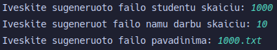

# Release aprašymai

## v.pradinė

Įvadimai studentų duomenys ir ir išvedami jų apskaičiuoti vidurkiai ar medianos į komdų eilutę 

## v0.1

Galima generuoti studentų duomenis ir sukurtos 2 projekto versijos 1 - naudojant std::vector, 2 - naudojant c masyvus

## V0.2

Pridėtas duomenų įvesties į ir išvesties iš failo pasirinkimas, panaikinta c masyvą naudojanti programos versija

## V0.3

Pridėtas duomenų rūšiavimas pagal pasirinktus kriterijus

## V0.3.1

Klaidų žinutės lietuvių kalba

## V0.4

Sukurtas README.md failas kuriami surašyti programos spartos matmenys ir pridėtas studentų failo generavimo funkcionalumas

## V0.4.1

Pataisyti ir papildyti matavimai, klaidų ištaisymas

## V0.4.2

Klaidos pataisymas

## V1.0 pradinis relizas

Sukurtos papildomai dvi programos veikimo versijos, papildytas README programos veikimo spartos matmenimis ir testavimo detalėmis

## V1.1

Studentas perkeltas į klasę

## V1.2

Relizuota "Rule of five" ir įvesties/išvesties operatorius Student klasėje

## V1.5

Sukurta bazinė klasė žmogus(Person) ir pritaikyta Studnet klasei

## V2.0

Sukurti Doxygen HTML ir PDF dokumentacija, pridėti unit testai naudojant gtest

# Naudojimos instrukcija

* Paleidimas: Nueiti į norimo naudojimo konteinerio build aplankalą ir paleisti programą "1-oji-uzduotis"
* Skaičiavimų atlikimas: 
  1. Paleidus programą duodamas pasirinkimas 1-6, jeigu norite atlikti skaičiavimus su studentai pasirinkite 1-4 pagal poreikį (ką pasirinkimai daro bus aprašyta programos veikimo metu)
  2. Jeigu pasirinkote 4 pasirinkimą įvesikte studentų failo pavadinimą (studentų failas turi būti tame pačiame aplankale iš kurios ir paleidote programą)
  3. Pasirinkite rūšiavimo būdą (vidurkių ir medianų rūšiavimas yra nuo mažiausio iki didžiausio)
  4. Pasirinkite išvesties būdą
  5. Pasirinkite skirstymo strategiją
  6. Jeigu pasirinkote įrašyti pažimius ranka ar generuoti juos sekite pragramoje nurodytas instrukcijas

# Diegimo instrukcija

  1. Nueikite į norimos programos versijos aplankalo (Deque/List/Vector)
      * ``cd Vector``  
        Arba
      * ``cd List``  
        Arba
      * ``cd Deque``
  2. Sukurkite build aplankalą ir įeikite į jį ``mkdir build && cd build``
  3. Paleiskite cmake comandą   ``cmake ..``
  4. Išeikite iš aplankalo ir sukompiliuokite programą   ``cd .. && cmake --build build``
  5. Pragrama bus build aplankale su pavadinimu "1-oji-uzduotis"

# Tyrimai

### Matavimo sistemos parametrai:
  > __CPU__: 7800x3d \
  > __RAM__: 32GB | 6000 MT/s \
  > __SSD__: NVMe M.2 | 7,000/7,000MB/s read/write

## Pirmas tyrimas (Failų kūrimas ir jų uždarymas)
* Kiekvienas studentas turi po 10 namų darbų rezultatų + egzaminas
* Laiko matavimui naudoajam `chrono` biblioteka
* Matavimai atliekami penkis kartus ir iš jų išgaunami vidurkiai
* Kodas buvo sukompiliuotas naudojant -O3 gaire

| Studentu sk. | Laikas 1 | Laikas 2 | Laikas 3 | Laikas 4 | Laikas 5 | Vidurkiai |
|--------------|----------|----------|----------|----------|----------|-----------|
| 1,000        | 866 μs   | 966 μs   | 877 μs   | 792 μs   | 936 μs   | 887 μs    |
| 10,000       | 6486 μs  | 6903 μs  | 6497 μs  | 6364 μs  | 6307 μs  | 6511 μs   |
| 100,000      | 68 ms    | 66 ms    | 65 ms    | 66 ms    | 67 ms    | 66 ms     |
| 1,000,000    | 594 ms   | 592 ms   | 587 ms   | 595 ms   | 608 ms   | 595 ms    |
| 10,000,000   | 5917 ms  | 5827 ms  | 5871 ms  | 5843 ms  | 5887 ms  | 5869 ms   |

>Failo kūrimo pavizdys:   

## Antrasis tyrimas (Duomenų apdorojimas)
* Laiko matavimui naudoajam `chrono` biblioteka
* Duomenys gaunaumi iš ankščiau sugeneruotų failų
* Kiekvienas studentas turi po 10 namų darbų rezultatų + egzaminas
* Matavimai atliekami penkis kartus ir iš jų išgaunami vidurkiai
* Matuojami vykdomi su penkiais skirtingais failo dydžiais
* Kodas buvo sukompiliuotas naudojant -O3 gaire
* Matuojami:
  * nuskaitymas iš failo
  * studentų rūšiavimą į dvi grupes/kategorijas
  * surūšiuotų studentų išvedimą į du naujus failus
  * visos programos veikimo laikas

### 1,000 studentų

| Matavimas      | Laikas 1 | Laikas 2 | Laikas 3 | Laikas 4 | Laikas 5 | Vidurkiai |
|----------------|----------|----------|----------|----------|----------|-----------|
| Nuskaitymas    | 545 μs   | 639 μs   | 518 μs   | 509 μs   | 485 μs   | 539 μs    |
| Rūšiavimas     | 101 μs   | 134 μs   | 100 μs   | 101 μs   | 101 μs   | 107 μs    |
| Išvedimas      | 340 μs   | 435 μs   | 394 μs   | 362 μs   | 369 μs   | 380 μs    |
| Veikimo laikas | 1092 μs  | 1334 μs  | 1113 μs  | 1076 μs  | 1056 μs  | 1134 μs   |

### 10,000 studentų

| Matavimas      | Laikas 1 | Laikas 2 | Laikas 3 | Laikas 4 | Laikas 5 | Vidurkiai |
|----------------|----------|----------|----------|----------|----------|-----------|
| Nuskaitymas    | 5524 μs  | 5118 μs  | 5430 μs  | 5809 μs  | 5024 μs  | 5381 μs   |
| Rūšiavimas     | 1043 μs  | 1129 μs  | 1133 μs  | 1107 μs  | 1106 μs  | 1104 μs   |
| Išvedimas      | 2795 μs  | 2835 μs  | 2870 μs  | 2859 μs  | 2770 μs  | 2826 μs   |
| Veikimo laikas | 10321 μs | 10053 μs | 10386 μs | 10760 μs | 9873 μs  | 10279 μs  |

### 100,000 studentų

| Matavimas      | Laikas 1 | Laikas 2 | Laikas 3 | Laikas 4 | Laikas 5 | Vidurkiai |
|----------------|----------|----------|----------|----------|----------|-----------|
| Nuskaitymas    | 47 ms    | 48 ms    | 46 ms    | 49 ms    | 47 ms    | 47 ms     |
| Rūšiavimas     | 7 ms     | 7 ms     | 6 ms     | 6 ms     | 6 ms     | 6 ms      |
| Išvedimas      | 27 ms    | 27 ms    | 25 ms    | 32 ms    | 33 ms    | 29 ms     |
| Veikimo laikas | 90 ms    | 92 ms    | 88 ms    | 98 ms    | 97 ms    | 93 ms     |

### 1,000,000 studentų

| Matavimas      | Laikas 1 | Laikas 2 | Laikas 3 | Laikas 4 | Laikas 5 | Vidurkiai |
|----------------|----------|----------|----------|----------|----------|-----------|
| Nuskaitymas    | 440 ms   | 443 ms   | 443 ms   | 444 ms   | 444 ms   | 443 ms    |
| Rūšiavimas     | 51 ms    | 51 ms    | 53 ms    | 50 ms    | 52 ms    | 51 ms     |
| Išvedimas      | 270 ms   | 273 ms   | 275 ms   | 267 ms   | 268 ms   | 270 ms    |
| Veikimo laikas | 848 ms   | 855 ms   | 859 ms   | 849 ms   | 853 ms   | 853 ms    |

### 10,000,000 studentų

| Matavimas      | Laikas 1 | Laikas 2 | Laikas 3 | Laikas 4 | Laikas 5 | Vidurkiai |
|----------------|----------|----------|----------|----------|----------|-----------|
| Nuskaitymas    | 4476 ms  | 4483 ms  | 4502 ms  | 4465 ms  | 4491 ms  | 4483 ms   |
| Rūšiavimas     | 668 ms   | 677 ms   | 685 ms   | 670 ms   | 679 ms   | 676 ms    |
| Išvedimas      | 2602 ms  | 2628 ms  | 2586 ms  | 2640 ms  | 2665 ms  | 2624 ms   |
| Veikimo laikas | 8686 ms  | 8750 ms  | 8730 ms  | 8727 ms  | 8781 ms  | 8735 ms   |

## Trečias tyrimas (Konteinerių testavimas)

* Laiko matavimui naudoajam `chrono` biblioteka
* Duomenys gaunaumi iš ankščiau sugeneruotų failų
* Kiekvienas studentas turi po 10 namų darbų rezultatų + egzaminas
* Matavimai atliekami penkis kartus ir iš jų išgaunami vidurkiai
* Matuojami vykdomi su penkiais skirtingais failo dydžiais
* Kodas buvo sukompiliuotas naudojant -O3 gaire
* Duomenys rūšiuojami studento pažymių vidurkio didėjimo tvarka
* Matuojas:
  * Duomenų nuskaitymas iš failų į atitinkamą konteinerį
  * Studentų rūšiavimas didėjimo tvarką konteineryje
  * Studentų skirstymas į dvi grupes/kategorijas
* Studentams saugoti bus naudojami 4 skirtingi konteineriai:
  * `std::vector`
  * `std::list`
  * `std::deque`
  * Mano sukurta `Vector` klasė

## Naudojant `std::vector`

### 1,000 studentų

| Matavimas   | Laikas 1 | Laikas 2 | Laikas 3 | Laikas 4 | Laikas 5 | Vidurkiai |
|-------------|----------|----------|----------|----------|----------|-----------|
| Nuskaitymas | 504 μs   | 573 μs   | 582 μs   | 609 μs   | 495 μs   | 552 μs    |
| Rušiavimas  | 53 μs    | 65 μs    | 67 μs    | 64 μs    | 52 μs    | 60 μs     |
| Skirstymas  | 98 μs    | 119 μs   | 112 μs   | 122 μs   | 99 μs    | 110 μs    |

### 10,000 studentų

| Matavimas   | Laikas 1 | Laikas 2 | Laikas 3 | Laikas 4 | Laikas 5 | Vidurkiai |
|-------------|----------|----------|----------|----------|----------|-----------|
| Nuskaitymas | 5396 μs  | 5124 μs  | 5232 μs  | 4846 μs  | 5028 μs  | 5125 μs   |
| Rušiavimas  | 826 μs   | 745 μs   | 785 μs   | 939 μs   | 943 μs   | 847 μs    |
| Skirstymas  | 955 μs   | 941 μs   | 965 μs   | 997 μs   | 1099 μs  | 991 μs    |

### 100,000 studentų

| Matavimas   | Laikas 1 | Laikas 2 | Laikas 3 | Laikas 4 | Laikas 5 | Vidurkiai |
|-------------|----------|----------|----------|----------|----------|-----------|
| Nuskaitymas | 49040 μs | 46073 μs | 48257 μs | 49288 μs | 50360 μs | 48603 μs  |
| Rušiavimas  | 11722 μs | 12060 μs | 11927 μs | 12071 μs | 12136 μs | 11983 μs  |
| Skirstymas  | 9479 μs  | 9184 μs  | 8919 μs  | 9446 μs  | 9274 μs  | 9260 μs   |

### 1,000,000 studentų

| Matavimas   | Laikas 1 | Laikas 2 | Laikas 3 | Laikas 4 | Laikas 5 | Vidurkiai |
|-------------|----------|----------|----------|----------|----------|-----------|
| Nuskaitymas | 430 ms   | 435 ms   | 437 ms   | 443 ms   | 436 ms   | 436 ms    |
| Rušiavimas  | 134 ms   | 140 ms   | 145 ms   | 141 ms   | 136 ms   | 139 ms    |
| Skirstymas  | 111 ms   | 109 ms   | 110 ms   | 110 ms   | 109 ms   | 109 ms    |

### 10,000,000 studentų

| Matavimas   | Laikas 1 | Laikas 2 | Laikas 3 | Laikas 4 | Laikas 5 | Vidurkiai |
|-------------|----------|----------|----------|----------|----------|-----------|
| Nuskaitymas | 4414 ms  | 4401 ms  | 4396 ms  | 4444 ms  | 4414 ms  | 4413 ms   |
| Rušiavimas  | 1743 ms  | 1665 ms  | 1729 ms  | 1722 ms  | 1660 ms  | 1703 ms   |
| Skirstymas  | 1350 ms  | 1357 ms  | 1348 ms  | 1343 ms  | 1350 ms  | 1349 ms   |

## Naudojant `std::list`

### 1,000 studentų

| Matavimas   | Laikas 1 | Laikas 2 | Laikas 3 | Laikas 4 | Laikas 5 | Vidurkiai |
|-------------|----------|----------|----------|----------|----------|-----------|
| Nuskaitymas | 560 μs   | 576 μs   | 606 μs   | 485 μs   | 594 μs   | 564 μs    |
| Rušiavimas  | 52 μs    | 64 μs    | 66 μs    | 52 μs    | 65 μs    | 59 μs     |
| Skirstymas  | 99 μs    | 121 μs   | 119 μs   | 94 μs    | 126 μs   | 111 μs    |

### 10,000 studentų

| Matavimas   | Laikas 1 | Laikas 2 | Laikas 3 | Laikas 4 | Laikas 5 | Vidurkiai |
|-------------|----------|----------|----------|----------|----------|-----------|
| Nuskaitymas | 4843 μs  | 5330 μs  | 4923 μs  | 4755 μs  | 5391 μs  | 5048 μs   |
| Rušiavimas  | 761 μs   | 738 μs   | 756 μs   | 757 μs   | 735 μs   | 749 μs    |
| Skirstymas  | 1005 μs  | 1068 μs  | 894 μs   | 882 μs   | 963 μs   | 962 μs    |

### 100,000 studentų

| Matavimas   | Laikas 1 | Laikas 2 | Laikas 3 | Laikas 4 | Laikas 5 | Vidurkiai |
|-------------|----------|----------|----------|----------|----------|-----------|
| Nuskaitymas | 47977 μs | 47000 μs | 48757 μs | 49032 μs | 59094 μs | 50372 μs  |
| Rušiavimas  | 12449 μs | 12087 μs | 12294 μs | 12273 μs | 12074 μs | 12235 μs  |
| Skirstymas  | 9721 μs  | 9184 μs  | 10342 μs | 9746 μs  | 9834 μs  | 9765 μs   |

### 1,000,000 studentų

| Matavimas   | Laikas 1 | Laikas 2 | Laikas 3 | Laikas 4 | Laikas 5 | Vidurkiai |
|-------------|----------|----------|----------|----------|----------|-----------|
| Nuskaitymas | 476 ms   | 472 ms   | 477 ms   | 477 ms   | 473 ms   | 475 ms    |
| Rušiavimas  | 285 ms   | 233 ms   | 256 ms   | 243 ms   | 233 ms   | 250 ms    |
| Skirstymas  | 167 ms   | 155 ms   | 168 ms   | 165 ms   | 162 ms   | 163 ms    |

### 10,000,000 studentų

| Matavimas   | Laikas 1 | Laikas 2 | Laikas 3 | Laikas 4 | Laikas 5 | Vidurkiai |
|-------------|----------|----------|----------|----------|----------|-----------|
| Nuskaitymas | 4643 ms  | 4681 ms  | 4723 ms  | 4707 ms  | 4613 ms  | 4673 ms   |
| Rušiavimas  | 5225 ms  | 5597 ms  | 5502 ms  | 5185 ms  | 5349 ms  | 5371 ms   |
| Skirstymas  | 1647 ms  | 1710 ms  | 1669 ms  | 1654 ms  | 1658 ms  | 1667 ms   |

## Naudojant `std::deque`

### 1,000 studentų

| Matavimas   | Laikas 1 | Laikas 2 | Laikas 3 | Laikas 4 | Laikas 5 | Vidurkiai |
|-------------|----------|----------|----------|----------|----------|-----------|
| Nuskaitymas | 589 μs   | 511 μs   | 480 μs   | 565 μs   | 593 μs   | 547 μs    |
| Rušiavimas  | 133 μs   | 108 μs   | 100 μs   | 124 μs   | 126 μs   | 118 μs    |
| Skirstymas  | 102 μs   | 84 μs    | 81 μs    | 99 μs    | 91 μs    | 91 μs     |

### 10,000 studentų

| Matavimas   | Laikas 1 | Laikas 2 | Laikas 3 | Laikas 4 | Laikas 5 | Vidurkiai |
|-------------|----------|----------|----------|----------|----------|-----------|
| Nuskaitymas | 4974 μs  | 4865 μs  | 4524 μs  | 4909 μs  | 4793 μs  | 4813 μs   |
| Rušiavimas  | 1103 μs  | 1213 μs  | 1129 μs  | 1070 μs  | 1106 μs  | 1124 μs   |
| Skirstymas  | 891 μs   | 814 μs   | 760 μs   | 852 μs   | 768 μs   | 817 μs    |

### 100,000 studentų

| Matavimas   | Laikas 1 | Laikas 2 | Laikas 3 | Laikas 4 | Laikas 5 | Vidurkiai |
|-------------|----------|----------|----------|----------|----------|-----------|
| Nuskaitymas | 45226 μs | 45315 μs | 57134 μs | 46732 μs | 45353 μs | 47952 μs  |
| Rušiavimas  | 13310 μs | 13076 μs | 13947 μs | 12625 μs | 12929 μs | 13177 μs  |
| Skirstymas  | 8509 μs  | 8437 μs  | 8048 μs  | 8168 μs  | 8224 μs  | 8277 μs   |

### 1,000,000 studentų

| Matavimas   | Laikas 1 | Laikas 2 | Laikas 3 | Laikas 4 | Laikas 5 | Vidurkiai |
|-------------|----------|----------|----------|----------|----------|-----------|
| Nuskaitymas | 453 ms   | 461 ms   | 458 ms   | 452 ms   | 453 ms   | 455 ms    |
| Rušiavimas  | 159 ms   | 166 ms   | 155 ms   | 164 ms   | 164 ms   | 161 ms    |
| Skirstymas  | 128 ms   | 132 ms   | 140 ms   | 136 ms   | 127 ms   | 132 ms    |

### 10,000,000 studentų

| Matavimas   | Laikas 1 | Laikas 2 | Laikas 3 | Laikas 4 | Laikas 5 | Vidurkiai |
|-------------|----------|----------|----------|----------|----------|-----------|
| Nuskaitymas | 4520 ms  | 4489 ms  | 4540 ms  | 4530 ms  | 5122 ms  | 4640 ms   |
| Rušiavimas  | 2040 ms  | 1952 ms  | 1952 ms  | 1982 ms  | 1969 ms  | 1979 ms   |
| Skirstymas  | 1496 ms  | 1479 ms  | 1503 ms  | 1482 ms  | 1500 ms  | 1492 ms   |

## Naudojant naują Vector klasę

### 1,000 studnetų

| Matavimas   | Laikas 1 | Laikas 2 | Laikas 3 | Laikas 4 | Laikas 5 | Vidurkiai |
|-------------|----------|----------|----------|----------|----------|-----------|
| Nuskaitymas | 582 μs   | 565 μs   | 576 μs   | 696 μs   | 596 μs   | 603 μs    |
| Rušiavimas  | 133 μs   | 129 μs   | 129 μs   | 129 μs   | 136 μs   | 131 μs    |
| Skirstymas  | 152 μs   | 146 μs   | 151 μs   | 156 μs   | 144 μs   | 150 μs    |

### 10,000 studentų

| Matavimas   | Laikas 1 | Laikas 2 | Laikas 3 | Laikas 4 | Laikas 5 | Vidurkiai |
|-------------|----------|----------|----------|----------|----------|-----------|
| Nuskaitymas | 6914 μs  | 7813 μs  | 6592 μs  | 6308 μs  | 6574 μs  | 6840 μs   |
| Rušiavimas  | 1801 μs  | 1753 μs  | 1473 μs  | 1493 μs  | 1813 μs  | 1667 μs   |
| Skirstymas  | 2303 μs  | 2246 μs  | 2304 μs  | 2066 μs  | 2123 μs  | 2208 μs   |

### 100,000 studentų

| Matavimas   | Laikas 1 | Laikas 2 | Laikas 3 | Laikas 4 | Laikas 5 | Vidurkiai |
|-------------|----------|----------|----------|----------|----------|-----------|
| Nuskaitymas | 56841 μs | 53579 μs | 54079 μs | 58699 μs | 54874 μs | 55614 μs  |
| Rušiavimas  | 18657 μs | 19323 μs | 19014 μs | 18681 μs | 18608 μs | 18857 μs  |
| Skirstymas  | 17205 μs | 12676 μs | 12705 μs | 13748 μs | 12706 μs | 13808 μs  |

### 1,000,000 studentų

| Matavimas   | Laikas 1 | Laikas 2 | Laikas 3 | Laikas 4 | Laikas 5 | Vidurkiai |
|-------------|----------|----------|----------|----------|----------|-----------|
| Nuskaitymas | 524 ms   | 508 ms   | 508 ms   | 507 ms   | 498 ms   | 509 ms    |
| Rušiavimas  | 232 ms   | 232 ms   | 227 ms   | 232 ms   | 236 ms   | 232 ms    |
| Skirstymas  | 291 ms   | 286 ms   | 276 ms   | 257 ms   | 270 ms   | 276 ms    |

### 10,000,000 studentų

| Matavimas   | Laikas 1 | Laikas 2 | Laikas 3 | Laikas 4 | Laikas 5 | Vidurkiai |
|-------------|----------|----------|----------|----------|----------|-----------|
| Nuskaitymas | 6073 ms  | 5933 ms  | 5660 ms  | 5653 ms  | 5420 ms  | 5758 ms   |
| Rušiavimas  | 2954 ms  | 2883 ms  | 2832 ms  | 2834 ms  | 2942 ms  | 2889 ms   |
| Skirstymas  | 3855 ms  | 3704 ms  | 3552 ms  | 3355 ms  | 3298 ms  | 3553 ms   |

## Ketvirtas tyrimas (Skirstymas)

* Laiko matavimui naudoajam `chrono` biblioteka
* Duomenys gaunaumi iš ankščiau sugeneruotų failų
* Kiekvienas studentas turi po 10 namų darbų rezultatų + egzaminas
* Matavimai atliekami penkis kartus ir iš jų išgaunami vidurkiai
* Kodas buvo sukompiliuotas naudojant -O3 gaire
* Matuojami vykdomi su penkiais skirtingais failo dydžiais
* Duomenys nerūšiuojami
* Naudojamos 3 strategijos:
1. Bendro studentai konteinerio skaidymas (rūšiavimas) į du naujus to paties tipo konteinerius
2. Bendro studentų konteinerio skaidymas (rūšiavimas) panaudojant tik vieną naują konteinerį
3. Bendro studentų konteinerio skaidymas (rūšiavimas) panaudojant "efektyvius" darbo su konteineriais metodus (``erase``, ``remove_if``)

### Vector

### 1 Strategija

| Studentu sk. | Laikas 1 | Laikas 2 | Laikas 3 | Laikas 4 | Laikas 5 | Vidurkiai |
|--------------|----------|----------|----------|----------|----------|-----------|
| 1,000        | 86 μs    | 82 μs    | 103 μs   | 87 μs    | 80 μs    | 87 μs     |
| 10,000       | 1064 μs  | 1212 μs  | 1122 μs  | 1155 μs  | 1119 μs  | 1134 μs   |
| 100,000      | 7906 μs  | 7346 μs  | 7287 μs  | 7355 μs  | 7335 μs  | 7445 μs   |
| 1,000,000    | 52 ms    | 53 ms    | 53 ms    | 49 ms    | 53 ms    | 52 ms     |
| 10,000,000   | 711 ms   | 707 ms   | 701 ms   | 699 ms   | 707 ms   | 705 ms    |

### 2 Strategija

| Studentu sk. | Laikas 1 | Laikas 2 | Laikas 3 | Laikas 4 | Laikas 5 | Vidurkiai |
|--------------|----------|----------|----------|----------|----------|-----------|
| 1,000        | 58 μs    | 70 μs    | 71 μs    | 60 μs    | 69 μs    | 65 μs     |
| 10,000       | 807 μs   | 761 μs   | 796 μs   | 769 μs   | 737 μs   | 774 μs    |
| 100,000      | 6122 μs  | 5950 μs  | 6083 μs  | 6338 μs  | 5944 μs  | 6087 μs   |
| 1,000,000    | 46 ms    | 47 ms    | 46 ms    | 46 ms    | 47 ms    | 46 ms     |
| 10,000,000   | 571 ms   | 570 ms   | 560 ms   | 562 ms   | 564 ms   | 565 ms    |

### 3 Strategija

| Studentu sk. | Laikas 1 | Laikas 2 | Laikas 3 | Laikas 4 | Laikas 5 | Vidurkiai |
|--------------|----------|----------|----------|----------|----------|-----------|
| 1,000        | 36 μs    | 41 μs    | 48 μs    | 43 μs    | 40 μs    | 41 μs     |
| 10,000       | 616 μs   | 562 μs   | 571 μs   | 614 μs   | 614 μs   | 595 μs    |
| 100,000      | 4613 μs  | 4101 μs  | 4130 μs  | 4014 μs  | 3839 μs  | 4139 μs   |
| 1,000,000    | 28 ms    | 28 ms    | 29 ms    | 29 ms    | 33 ms    | 29 ms     |
| 10,000,000   | 355 ms   | 356 ms   | 354 ms   | 355 ms   | 351 ms   | 354 ms    |

### List

### 1 Strategija

| Studentu sk. | Laikas 1 | Laikas 2 | Laikas 3 | Laikas 4 | Laikas 5 | Vidurkiai |
|--------------|----------|----------|----------|----------|----------|-----------|
| 1,000        | 138 μs   | 103 μs   | 97 μs    | 103 μs   | 119 μs   | 112 μs    |
| 10,000       | 1207 μs  | 1020 μs  | 1117 μs  | 953 μs   | 994 μs   | 1058 μs   |
| 100,000      | 9856 μs  | 9813 μs  | 9280 μs  | 9690 μs  | 10011 μs | 9730 μs   |
| 1,000,000    | 96 ms    | 100 ms   | 97 ms    | 97 ms    | 98 ms    | 97 ms     |
| 10,000,000   | 946 ms   | 956 ms   | 956 ms   | 948 ms   | 1000 ms  | 961 ms    |

### 2 Strategija

| Studentu sk. | Laikas 1 | Laikas 2 | Laikas 3 | Laikas 4 | Laikas 5 | Vidurkiai |
|--------------|----------|----------|----------|----------|----------|-----------|
| 1,000        | 17 μs    | 21 μs    | 18 μs    | 25 μs    | 16 μs    | 19 μs     |
| 10,000       | 218 μs   | 177 μs   | 175 μs   | 181 μs   | 179 μs   | 186 μs    |
| 100,000      | 1699 μs  | 1693 μs  | 1693 μs  | 1682 μs  | 1678 μs  | 1689 μs   |
| 1,000,000    | 16 ms    | 17 ms    | 17 ms    | 17 ms    | 16 ms    | 16 ms     |
| 10,000,000   | 172 ms   | 172 ms   | 173 ms   | 170 ms   | 170 ms   | 171 ms    |

### 3 Strategija

| Studentu sk. | Laikas 1 | Laikas 2 | Laikas 3 | Laikas 4 | Laikas 5 | Vidurkiai |
|--------------|----------|----------|----------|----------|----------|-----------|
| 1,000        | 60 μs    | 50 μs    | 63 μs    | 49 μs    | 50 μs    | 54 μs     |
| 10,000       | 529 μs   | 517 μs   | 674 μs   | 553 μs   | 677 μs   | 590 μs    |
| 100,000      | 5377 μs  | 5615 μs  | 5088 μs  | 5006 μs  | 5225 μs  | 5262 μs   |
| 1,000,000    | 66 ms    | 69 ms    | 68 ms    | 68 ms    | 66 ms    | 67 ms     |
| 10,000,000   | 668 ms   | 668 ms   | 685 ms   | 665 ms   | 676 ms   | 672 ms    |

### Deque

### 1 Strategija

| Studentu sk. | Laikas 1 | Laikas 2 | Laikas 3 | Laikas 4 | Laikas 5 | Vidurkiai |
|--------------|----------|----------|----------|----------|----------|-----------|
| 1,000        | 84 μs    | 85 μs    | 138 μs   | 107 μs   | 84 μs    | 99 μs     |
| 10,000       | 844 μs   | 804 μs   | 786 μs   | 898 μs   | 832 μs   | 832 μs    |
| 100,000      | 10858 μs | 8951 μs  | 8304 μs  | 7947 μs  | 8524 μs  | 8916 μs   |
| 1,000,000    | 82 ms    | 84 ms    | 80 ms    | 80 ms    | 80 ms    | 81 ms     |
| 10,000,000   | 820 ms   | 818 ms   | 810 ms   | 820 ms   | 819 ms   | 817 ms    |

### 2 Strategija

| Studentu sk. | Laikas 1 | Laikas 2 | Laikas 3 | Laikas 4 | Laikas 5 | Vidurkiai |
|--------------|----------|----------|----------|----------|----------|-----------|
| 1,000        | 37 μs    | 34 μs    | 33 μs    | 35 μs    | 29 μs    | 33 μs     |
| 10,000       | 248 μs   | 249 μs   | 250 μs   | 266 μs   | 257 μs   | 254 μs    |
| 100,000      | 2483 μs  | 2414 μs  | 2526 μs  | 2483 μs  | 2520 μs  | 2485 μs   |
| 1,000,000    | 24 ms    | 24 ms    | 24 ms    | 24 ms    | 23 ms    | 23 ms     |
| 10,000,000   | 243 ms   | 253 ms   | 239 ms   | 243 ms   | 243 ms   | 244 ms    |

### 3 Strategija

| Studentu sk. | Laikas 1 | Laikas 2 | Laikas 3 | Laikas 4 | Laikas 5 | Vidurkiai |
|--------------|----------|----------|----------|----------|----------|-----------|
| 1,000        | 47 μs    | 48 μs    | 53 μs    | 57 μs    | 58 μs    | 52 μs     |
| 10,000       | 460 μs   | 446 μs   | 452 μs   | 425 μs   | 436 μs   | 443 μs    |
| 100,000      | 4231 μs  | 4184 μs  | 4566 μs  | 4238 μs  | 4094 μs  | 4262 μs   |
| 1,000,000    | 49 ms    | 46 ms    | 48 ms    | 49 ms    | 48 ms    | 48 ms     |
| 10,000,000   | 465 ms   | 466 ms   | 467 ms   | 465 ms   | 468 ms   | 466 ms    |

## Penktas tyrimas (Struct vs Class)

* Laiko matavimui naudoajam `chrono` biblioteka
* Duomenys gaunaumi iš ankščiau sugeneruotų failų
* Kiekvienas studentas turi po 10 namų darbų rezultatų + egzaminas
* Matavimai atliekami penkis kartus ir iš jų išgaunami vidurkiai
* Matuojami du kodo atvėjai, Vienas naudojant Struktūras studentams kitas klases
* Matavimui naudajami tik 1,000,000 ir 10,000,000 studentų kiekiai
* Matavimui bus lyginami -O1, -O2 ir -O3 kompiliavmo gairės (3 atvėjai, kodo veikimo greitis ir bin failo dydis)
* Matuojamas pilnas programos veikimo laikas (neskaitant vartotojo įvesties)
* Naudojamas vector tipo konteineris studentų masyui saugoti

### Veikimo greitis -O1

| (stud. sk.) Duom. tipas | Laikas 1 | Laikas 2 | Laikas 3 | Laikas 4 | Laikas 5 | Vidurkiai |
|-------------------------|----------|----------|----------|----------|----------|-----------|
| (1,000,000) Klasė       | 1562 ms  | 1619 ms  | 1616 ms  | 1630 ms  | 1593 ms  | 1604 ms   |
| (1,000,000) Struktūra   | 1306 ms  | 1333 ms  | 1321 ms  | 1328 ms  | 1311 ms  | 1319 ms   |
| (10,000,000) Klasė      | 17244 ms | 17597 ms | 17800 ms | 17520 ms | 17590 ms | 17550 ms  |
| (10,000,000) Struktūra  | 13950 ms | 14018 ms | 14012 ms | 14125 ms | 14019 ms | 14024 ms  |

Klasės metodo bin dydis: 107.94 KiB
Struktūros metodo bin dydis: 110.88 KiB

### Veikimo greitis -O2

| (stud. sk.) Duom. tipas | Laikas 1 | Laikas 2 | Laikas 3 | Laikas 4 | Laikas 5 | Vidurkiai |
|-------------------------|----------|----------|----------|----------|----------|-----------|
| (1,000,000) Klasė       | 1559 ms  | 1607 ms  | 1599 ms  | 1606 ms  | 1597 ms  | 1593 ms   |
| (1,000,000) Struktūra   | 1443 ms  | 1338 ms  | 1337 ms  | 1359 ms  | 1358 ms  | 1367 ms   |
| (10,000,000) Klasė      | 16920 ms | 17292 ms | 17082 ms | 17048 ms | 17276 ms | 17123 ms  |
| (10,000,000) Struktūra  | 14104 ms | 14132 ms | 14284 ms | 14277 ms | 14272 ms | 14213 ms  |

Klasės metodo bin dydis: 117.92 KiB
Struktūros metodo bin dydis: 119.91 KiB

### Veikimo greitis -O3

| (stud. sk.) Duom. tipas | Laikas 1 | Laikas 2 | Laikas 3 | Laikas 4 | Laikas 5 | Vidurkiai |
|-------------------------|----------|----------|----------|----------|----------|-----------|
| (1,000,000) Klasė       | 1569 ms  | 1556 ms  | 1550 ms  | 1551 ms  | 1572 ms  | 1559 ms   |
| (1,000,000) Struktūra   | 1264 ms  | 1329 ms  | 1291 ms  | 1278 ms  | 1292 ms  | 1290 ms   |
| (10,000,000) Klasė      | 16396 ms | 16528 ms | 16528 ms | 16639 ms | 16589 ms | 16536 ms  |
| (10,000,000) Struktūra  | 13311 ms | 13454 ms | 13388 ms | 13425 ms | 13332 ms | 13382 ms  |

Klasės metodo bin dydis: 129.52 KiB
Struktūros metodo bin dydis: 123.69 KiB
